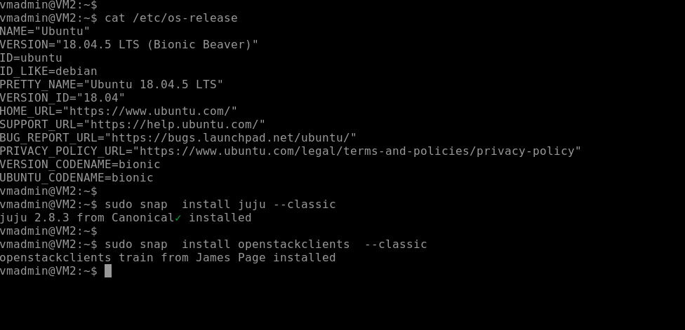

# OPenstack Deployment over LXD 

## juju connecting LXD 

## understanding bridge and its problem for VMS 

## Real DHCP to  virtual bridge

## installing juj and openstack clients software

## start lxc container as juju controller

## checking juju controller is running 

# Openstack service accessing from cli 

