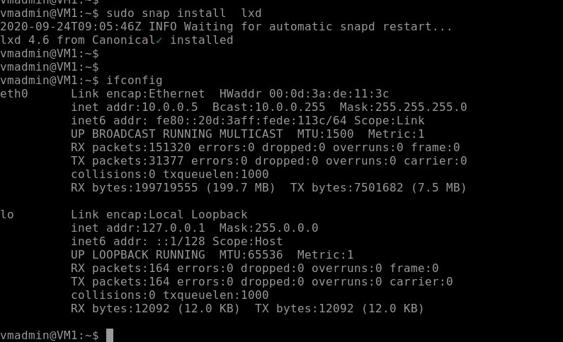
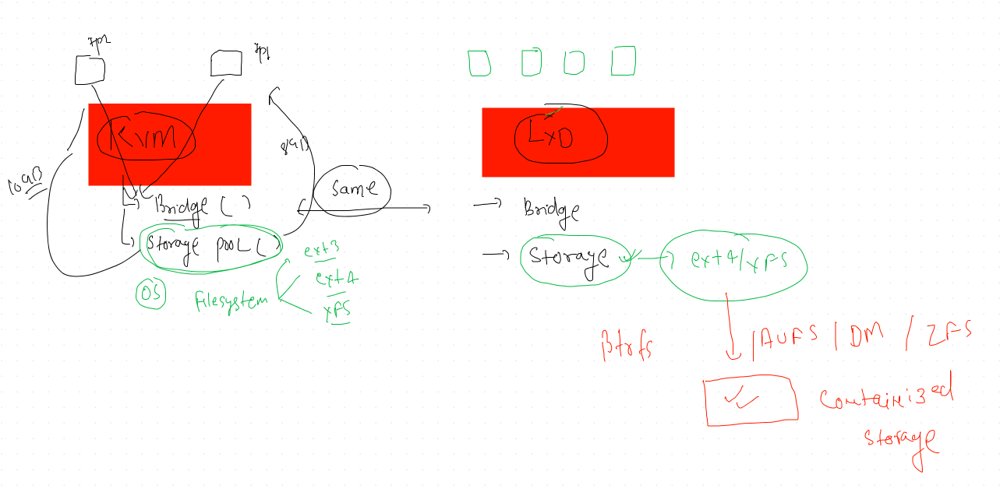

# Openstack starting again 

##  openstack Nova support 

## openstack release 

##  OPenstack Deployment methods 

## Understanding MAAS the foundation provider 

## Understanding Juju deployer 

# LXD on Ubuntu 16.04  

## checking platform and its details 

## INstallation of LXD 

## LXD storage pool and Bridge 

## More on storage pool 

## ZFS installation 

## LXD init process

## starting container with lxc client 

